# Dependency Analysis

## Executive Summary

- **Total require() statements**: ~90
- **Direct whisker module dependencies**: ~45 (VIOLATIONS)
- **Interface requires**: 13 (ACCEPTABLE)
- **External dependencies**: ~15 (json, cjson, tinta)
- **Coupling violations**: HIGH (67% of modules)

## Direct Module Dependencies (Coupling Violations)

These modules use `require("whisker.X.Y")` instead of DI container:

### Core Module Violations

**core/engine.lua** (CRITICAL)
```lua
require("whisker.core.story")          -- Line 26, 56
require("whisker.core.game_state")     -- Line 40, 70
require("whisker.core.lua_interpreter")-- Line 46, 76
```
Severity: HIGH - Core engine tightly coupled to other core modules.

**core/story.lua**
```lua
require("whisker.core.passage")        -- Line 438, 463, 509
```
Severity: MEDIUM - Story depends on Passage for deserialization.

**core/passage.lua**
```lua
require("whisker.core.choice")         -- Line 170, 195, 232
```
Severity: LOW - Passage depends on Choice for deserialization.

### Infrastructure Violations

**infrastructure/save_system.lua** (CRITICAL)
```lua
require("whisker.utils.json")          -- Line 49, 75, 162
require("whisker.core.story")          -- Line 88
require("whisker.core.game_state")     -- Line 113
require("whisker.utils.file_utils")    -- Line 197, 204, 211
```
Severity: HIGH - SaveSystem should use injected serializer interface.

**infrastructure/asset_manager.lua**
- No whisker module dependencies (GOOD)
- Platform detection at module level (acceptable)

### Format Module Violations

**format/format_converter.lua**
```lua
require("whisker.format.story_to_whisker")  -- Line 8
require("whisker.format.whisker_format")    -- Line 22
require("whisker.format.twine_importer")    -- Line 23
```
Severity: HIGH - Should use IFormat interface implementations via DI.

**format/whisker_loader.lua**
```lua
require("whisker.core.story")          -- Line 66
require("whisker.core.passage")        -- Line 67
require("whisker.core.choice")         -- Line 68
require("whisker.utils.json")          -- Line 71
require("whisker.format.compact_converter") -- Line 74
```
Severity: CRITICAL - Loader tightly coupled to core domain models.

**format/twine_importer.lua**
```lua
require("whisker.format.whisker_format")  -- Line 18
```

**format/story_to_whisker.lua**
```lua
require("whisker.utils.json")          -- Line 6
```

**format/parsers/*.lua**
```lua
require("whisker.format.parsers.harlowe")  -- chapbook.lua:4
require("whisker.format.parsers.harlowe")  -- snowman.lua:4
require("whisker.format.parsers.harlowe")  -- sugarcube.lua:5
```
Severity: MEDIUM - Parser inheritance/delegation pattern.

### Script Module Violations

**script/compiler.lua**
```lua
require("whisker.script.ast")          -- Line 6
```
Severity: LOW - Compiler depends on AST (acceptable).

**script/init.lua**
```lua
require("whisker.script.lexer")        -- Line 6
require("whisker.script.parser")       -- Line 7
require("whisker.script.compiler")     -- Line 8
require("whisker.script.ast")          -- Line 9
require("whisker.script.errors")       -- Line 10
```
Severity: LOW - Facade module (acceptable pattern).

**script/parser.lua**
```lua
require("whisker.script.ast")          -- Line 6
```

### Tools Violations

**tools/whiskerc/init.lua**
```lua
require("whisker.script.lexer")        -- Line 6
require("whisker.script.parser")       -- Line 7
require("whisker.script.compiler")     -- Line 8
require("whisker.script.errors")       -- Line 9
```
Severity: LOW - CLI tool (acceptable).

### Utils Violations

**utils/file_utils.lua**
```lua
require("whisker.utils.json")          -- Line 240, 245
```
Severity: MEDIUM - Utility circular dependency risk.

**utils/json.lua**
- No dependencies (GOOD)

**utils/string_utils.lua**
- No whisker dependencies (GOOD)

**utils/template_processor.lua**
- No whisker dependencies (GOOD)

### Runtime Violations

**runtime/cli_runtime.lua**
```lua
require('src.core.engine')             -- Line 8 (wrong path!)
require('src.utils.json')              -- Line 9 (wrong path!)
require('src.utils.template_processor')-- Line 10 (wrong path!)
```
Severity: CRITICAL - Uses old 'src.' paths instead of 'whisker.'.

**runtime/desktop_runtime.lua**
```lua
require('src.core.engine')             -- Line 9 (wrong path!)
require('src.utils.json')              -- Line 10 (wrong path!)
```
Severity: CRITICAL - Uses old 'src.' paths.

**runtime/web_runtime.lua**
```lua
require('whisker')                     -- Line 8
require('json')                        -- Line 9
require('whisker.utils.template_processor') -- Line 10
```
Severity: MEDIUM - Mixed root and namespaced requires.

### Editor Violations

**editor/export/exporter.lua**
```lua
require('json')                        -- Line 22
```
Severity: LOW - External dependency.

**editor/core/project.lua**
```lua
require('json')                        -- Line 109, 120
```

## Acceptable Requires

### Interface Requires (GOOD)

**interfaces/init.lua**
```lua
require("whisker.interfaces.format")       -- Line 8
require("whisker.interfaces.state")        -- Line 9
require("whisker.interfaces.serializer")   -- Line 10
require("whisker.interfaces.condition")    -- Line 11
require("whisker.interfaces.engine")       -- Line 12
require("whisker.interfaces.plugin")       -- Line 13
```
Status: ACCEPTABLE - Facade for interface definitions.

**kernel/init.lua**
```lua
require("whisker.kernel.container")    -- Line 8
require("whisker.kernel.events")       -- Line 9
require("whisker.kernel.registry")     -- Line 10
require("whisker.kernel.loader")       -- Line 11
require("whisker.kernel.bootstrap")    -- Line 12
```
Status: ACCEPTABLE - Facade for kernel modules.

**kernel/bootstrap.lua**
```lua
require("whisker.kernel.container")    -- Line 7
require("whisker.kernel.events")       -- Line 8
require("whisker.kernel.registry")     -- Line 9
require("whisker.kernel.loader")       -- Line 10
```
Status: ACCEPTABLE - Bootstrap needs these to set up DI.

### Format Implementations Using DI (GOOD)

**formats/ink/engine.lua**
```lua
require("whisker.vendor.tinta")        -- Line 43 (external)
require("cjson")                       -- Line 44 (external)
require("whisker.formats.ink.state_bridge") -- Line 478 (internal)
```
Status: MOSTLY GOOD - Uses DI for main dependencies.

**formats/ink/converter.lua**
```lua
require("cjson")                       -- Line 15
```

**formats/ink/exporter.lua**
```lua
require("cjson")                       -- Line 95
```

**formats/ink/init.lua**
```lua
require("whisker.formats.ink.converter")  -- Line 68
require("whisker.formats.ink.exporter")   -- Line 93, 109
```

## External Dependencies

**JSON Libraries**
- `require("cjson")` - Used in formats/ink/* (6 instances)
- `require("json")` - Used in editor/* (3 instances)
- `require("whisker.utils.json")` - Internal JSON implementation (9 instances)

**Tinta (Ink Runtime)**
- `require("whisker.vendor.tinta")` - Used in formats/ink/engine.lua

## Dependency Graph (Mermaid)

```mermaid
graph TB
    %% Kernel Layer (Good - No Dependencies)
    Container[kernel/container.lua]
    Events[kernel/events.lua]
    Registry[kernel/registry.lua]
    Loader[kernel/loader.lua]
    Bootstrap[kernel/bootstrap.lua]

    %% Interfaces (Good - No Dependencies)
    IFormat[interfaces/format.lua]
    IState[interfaces/state.lua]
    ISerializer[interfaces/serializer.lua]
    IEngine[interfaces/engine.lua]

    %% Core Layer (BAD - Tightly Coupled)
    Engine[core/engine.lua]
    Story[core/story.lua]
    GameState[core/game_state.lua]
    Passage[core/passage.lua]
    Choice[core/choice.lua]
    LuaInterpreter[core/lua_interpreter.lua]

    %% Format Layer (BAD - Coupling Violations)
    WhiskerLoader[format/whisker_loader.lua]
    FormatConverter[format/format_converter.lua]
    TwineImporter[format/twine_importer.lua]
    StoryToWhisker[format/story_to_whisker.lua]

    %% Infrastructure (BAD - Coupling Violations)
    SaveSystem[infrastructure/save_system.lua]

    %% Utils
    JsonUtil[utils/json.lua]
    FileUtils[utils/file_utils.lua]

    %% Formats/Ink (GOOD - Uses DI)
    InkEngine[formats/ink/engine.lua]
    InkConverter[formats/ink/converter.lua]

    %% Dependencies
    Bootstrap --> Container
    Bootstrap --> Events
    Bootstrap --> Registry
    Bootstrap --> Loader

    %% VIOLATIONS: Core Layer
    Engine -->|VIOLATION| Story
    Engine -->|VIOLATION| GameState
    Engine -->|VIOLATION| LuaInterpreter
    Story -->|VIOLATION| Passage
    Passage -->|VIOLATION| Choice

    %% VIOLATIONS: Format Layer
    WhiskerLoader -->|VIOLATION| Story
    WhiskerLoader -->|VIOLATION| Passage
    WhiskerLoader -->|VIOLATION| Choice
    WhiskerLoader -->|VIOLATION| JsonUtil
    FormatConverter -->|VIOLATION| TwineImporter
    FormatConverter -->|VIOLATION| StoryToWhisker
    TwineImporter -->|VIOLATION| Story

    %% VIOLATIONS: Infrastructure
    SaveSystem -->|VIOLATION| Story
    SaveSystem -->|VIOLATION| GameState
    SaveSystem -->|VIOLATION| JsonUtil
    SaveSystem -->|VIOLATION| FileUtils

    %% Utils Internal
    FileUtils -->|VIOLATION| JsonUtil

    %% GOOD: DI Usage
    InkEngine -.->|DI: events| Events
    InkEngine -.->|DI: state| IState
    InkConverter -.->|DI: events| Events

    style Engine fill:#f99,stroke:#333,stroke-width:2px
    style Story fill:#f99,stroke:#333,stroke-width:2px
    style WhiskerLoader fill:#f99,stroke:#333,stroke-width:2px
    style SaveSystem fill:#f99,stroke:#333,stroke-width:2px
    style InkEngine fill:#9f9,stroke:#333,stroke-width:2px
    style Container fill:#9f9,stroke:#333,stroke-width:2px
    style Events fill:#9f9,stroke:#333,stroke-width:2px
```



## Recommendations

### Critical (Fix Immediately)

1. **Runtime modules** - Fix broken 'src.*' paths:
   - `runtime/cli_runtime.lua`
   - `runtime/desktop_runtime.lua`

2. **Core/Engine** - Refactor to use DI:
   ```lua
   -- BAD (current)
   local Story = require("whisker.core.story")
   local story = Story.new()

   -- GOOD (target)
   function Engine.new(deps)
     self.story = deps.story  -- injected
   end
   ```

### High Priority

3. **infrastructure/save_system.lua** - Use ISerializer interface
4. **format/whisker_loader.lua** - Inject Story, Passage, Choice via container
5. **format/format_converter.lua** - Use IFormat implementations via registry

### Medium Priority

6. **utils/file_utils.lua** - Remove json dependency (pass serializer)
7. **script/* modules** - Acceptable as-is, but could use DI for compiler pipeline

### Low Priority

8. **format/parsers/*.lua** - Refactor parser inheritance
9. **editor/* modules** - Inject JSON serializer

## Modularity Score

- **Kernel modules**: 100% (6/6 use DI correctly)
- **Format/Ink modules**: 100% (6/6 use DI correctly)
- **Core modules**: 0% (0/9 use DI)
- **Format parsers**: 0% (0/19 use DI)
- **Infrastructure**: 0% (0/5 use DI)
- **Overall**: 18% (12/67 modules are properly decoupled)

**Grade**: F (Failing) - Majority of codebase violates modularity principles.
