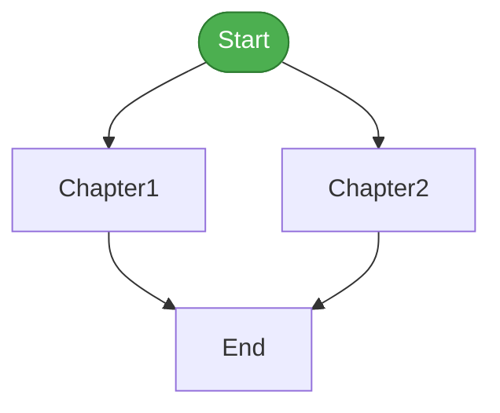
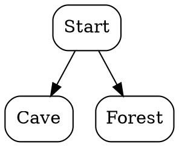
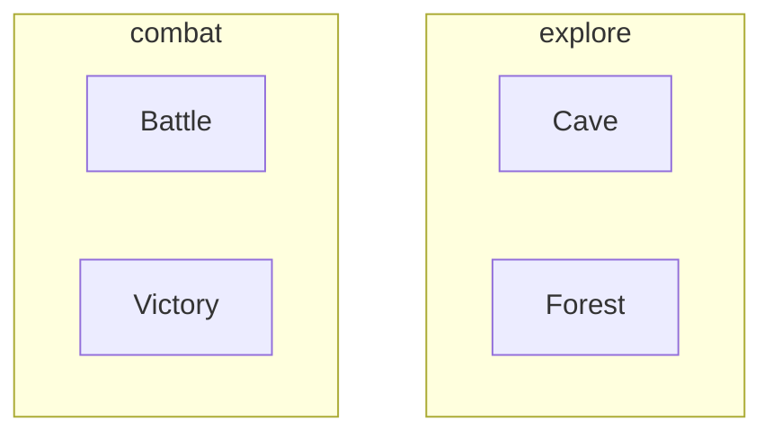

# whisker-graph: Story Visualizer

whisker-graph generates visual representations of story passage flow.

## Installation

```bash
luarocks install whisker-graph
```

Verify installation:

```bash
whisker-graph --version
# whisker-graph 0.1.0
```

## Basic Usage

### Generate Mermaid Diagram

```bash
whisker-graph story.ink
```

Output:


### Save to File

```bash
whisker-graph -o story.mmd story.ink
```

## Command-Line Options

```
whisker-graph [options] <story-file>

Options:
  -h, --help           Show help message
  -v, --version        Show version
  -f, --format FORMAT  Output format: mermaid, dot, json
  -o, --output FILE    Output file (default: stdout)
  --no-unreachable     Hide unreachable passages
  --clusters           Group passages by tags/sections
```

## Output Formats

### Mermaid (Default)

Best for Markdown documentation and GitHub:

```bash
whisker-graph story.ink
```

Output:
```
graph TD
    Start(["Start"]):::start
    Cave["Cave"]
    Forest["Forest"]
    Start --> Cave
    Start --> Forest

    classDef start fill:#4CAF50
```

Embed in Markdown:
~~~markdown

~~~

### Graphviz DOT

For advanced graph rendering:

```bash
whisker-graph -f dot story.ink
```

Output:


Render with Graphviz:
```bash
whisker-graph -f dot story.ink | dot -Tpng -o story.png
whisker-graph -f dot story.ink | dot -Tsvg -o story.svg
```

### JSON

For programmatic analysis:

```bash
whisker-graph -f json story.ink
```

Output:
```json
{
  "nodes": [
    {
      "id": "Start",
      "line": 1,
      "tags": [],
      "unreachable": false
    },
    {
      "id": "Cave",
      "line": 10,
      "tags": ["explore"],
      "unreachable": false
    }
  ],
  "edges": [
    {
      "from": "Start",
      "to": "Cave",
      "type": "choice"
    }
  ]
}
```

## Visual Styling

### Node Colors

| Color | Meaning |
|-------|---------|
| Green | Start passage |
| White | Normal passage |
| Orange | Unreachable passage |
| Red | Undefined target (missing passage) |

### Edge Styles

| Style | Meaning |
|-------|---------|
| Solid arrow | Direct divert (`-> Target`) |
| Labeled arrow | Choice navigation (`* [text] -> Target`) |

## Options

### Hide Unreachable Passages

```bash
whisker-graph --no-unreachable story.ink
```

Only shows passages reachable from Start.

### Group by Tags (Clusters)

```bash
whisker-graph --clusters story.ink
```

Groups passages by tags in subgraphs:


## Use Cases

### Documentation

Generate story structure for README:

```bash
whisker-graph -o docs/story-flow.mmd src/story.ink
```

### Find Dead Ends

Visualize to spot passages with no exits:

```bash
whisker-graph story.ink | grep -E '^\s+\w+\[' | wc -l  # Count nodes
whisker-graph story.ink | grep -E '^\s+\w+ -->' | wc -l  # Count edges
```

### Complexity Analysis

Use JSON output for metrics:

```bash
whisker-graph -f json story.ink | jq '{
  passages: (.nodes | length),
  connections: (.edges | length),
  unreachable: [.nodes[] | select(.unreachable)] | length
}'
```

Output:
```json
{
  "passages": 25,
  "connections": 42,
  "unreachable": 3
}
```

### CI Validation

Check for unreachable passages:

```bash
unreachable=$(whisker-graph -f json story.ink | jq '[.nodes[] | select(.unreachable)] | length')
if [ "$unreachable" -gt 0 ]; then
  echo "Warning: $unreachable unreachable passage(s)"
  exit 1
fi
```

## IDE Integration

### VSCode

The Whisker extension includes graph visualization:

1. Open a story file
2. Click the graph icon in the title bar
3. Interactive Mermaid diagram appears

### Command Line + Browser

```bash
# Generate and open in browser
whisker-graph story.ink > /tmp/story.mmd
echo '```mermaid' > /tmp/story.html
cat /tmp/story.mmd >> /tmp/story.html
echo '```' >> /tmp/story.html
open /tmp/story.html  # macOS
# xdg-open /tmp/story.html  # Linux
```

### Graphviz Viewer

```bash
whisker-graph -f dot story.ink | dot -Tx11
```

## Examples

### Complete Pipeline

```bash
# Parse story and create SVG
whisker-graph -f dot story.ink | dot -Tsvg -o story-graph.svg

# Create PNG with custom styling
whisker-graph -f dot story.ink | \
  dot -Gdpi=150 -Nfontname=Arial -Efontname=Arial -Tpng -o story-graph.png
```

### Mermaid in GitHub

Add to your README:

~~~markdown
## Story Structure


~~~

### JSON Analysis Script

```lua
local json = require('cjson')
local handle = io.popen('whisker-graph -f json story.ink')
local data = json.decode(handle:read('*a'))
handle:close()

print("Story Statistics:")
print("  Passages:", #data.nodes)
print("  Connections:", #data.edges)

local choice_count = 0
for _, edge in ipairs(data.edges) do
  if edge.type == "choice" then
    choice_count = choice_count + 1
  end
end
print("  Choices:", choice_count)
```

## Troubleshooting

### "Cannot open file"

Check file exists:
```bash
ls -la story.ink
```

### "Unknown file format"

Ensure supported extension: `.ink`, `.twee`, `.tw`, `.wscript`

### Graphviz Not Rendering

Install Graphviz:
```bash
# macOS
brew install graphviz

# Ubuntu/Debian
sudo apt install graphviz

# Windows
choco install graphviz
```
