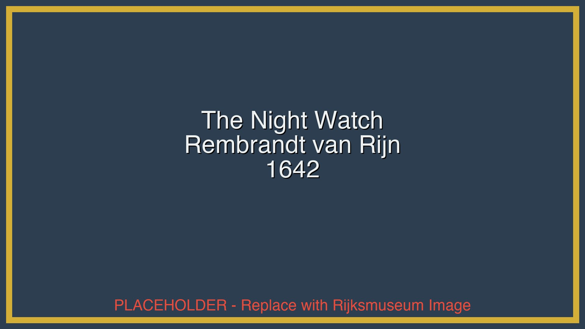

# Rijksmuseum Tour - Addon Integration Guide

## Overview

The Rijksmuseum "Masters of Light" tour is designed as a **complete, self-contained addon module** for the Whisker museum tour system. This guide explains how to integrate and deploy it.

## Addon Structure

```
rijksmuseum/                          # Addon root
├── addon.json                        # Addon manifest
├── rijksmuseum_tour.whisker          # Tour story (17 passages)
├── README.md                         # Quick start
├── PROPOSAL.md                       # Business documentation
├── IMPLEMENTATION_SUMMARY.md         # Technical documentation
├── ADDON_INTEGRATION.md              # This file
│
├── assets/                           # All media assets
│   ├── qr_codes/ (13 PNGs)          # ✅ Production-ready
│   ├── images/ (13 JPEGs)           # ✅ Placeholders included
│   └── audio/                        # ✅ Ready for TTS/recording
│       ├── en/ (12 files)
│       └── nl/ (12 files)
│
└── [generation scripts]              # Utilities for asset management
```

## Addon Manifest (addon.json)

```json
{
  "id": "rijksmuseum-golden-age-tour",
  "name": "Rijksmuseum: Masters of Light",
  "version": "1.0.0",
  "type": "museum-tour",
  "description": "12 Dutch Golden Age masterpieces",

  "files": {
    "story": "rijksmuseum_tour.whisker",
    "assets": {
      "qr_codes": "assets/qr_codes/",
      "images": "assets/images/",
      "audio": {
        "en": "assets/audio/en/",
        "nl": "assets/audio/nl/"
      }
    }
  },

  "integration": {
    "webRuntime": "../../web_runtime/",
    "loadMethod": "dynamic",
    "assetPath": "relative"
  }
}
```

## Integration Methods

### Method 1: Direct Integration (Recommended)

**For production deployment where the Rijksmuseum tour is the primary offering.**

```bash
# 1. Copy tour to web runtime
cp -r examples/museum_tours/rijksmuseum examples/web_runtime/tours/

# 2. Update web runtime to load tour
cd examples/web_runtime
# Edit museum-client.js to load: tours/rijksmuseum/rijksmuseum_tour.whisker

# 3. Deploy
python3 -m http.server 8000
open http://localhost:8000/museum.html
```

**Load in JavaScript:**
```javascript
// In museum-client.js
async function loadRijksmuseumTour() {
    const response = await fetch('tours/rijksmuseum/rijksmuseum_tour.whisker');
    const story = await response.json();
    client.loadStory(story);
    client.gotoPassage('welcome');
}
```

### Method 2: Addon System (Multi-Tour Support)

**For systems that offer multiple museum tours.**

Create a tour selector:

```html
<!-- In museum.html -->
<div id="tour-selector" class="tour-selector">
    <h2>Select Your Tour</h2>
    <div class="tour-grid">
        <div class="tour-card" data-tour="rijksmuseum">
            
            <h3>Rijksmuseum: Masters of Light</h3>
            <p>12 Dutch Golden Age masterpieces</p>
            <span class="duration">45-60 minutes</span>
            <button>Start Tour</button>
        </div>
        <!-- Additional tours... -->
    </div>
</div>
```

```javascript
// Load tour dynamically
async function loadTour(tourId) {
    const manifest = await fetch(`tours/${tourId}/addon.json`).then(r => r.json());
    const story = await fetch(`tours/${tourId}/${manifest.files.story}`).then(r => r.json());

    // Set asset paths
    client.assetBasePath = `tours/${tourId}/`;

    // Load and start
    client.loadStory(story);
    client.gotoPassage(story.settings.startPassage || 'welcome');
}
```

### Method 3: Standalone Deployment

**For Rijksmuseum-specific deployment.**

```bash
# 1. Create standalone directory
mkdir rijksmuseum-tour-standalone
cd rijksmuseum-tour-standalone

# 2. Copy files
cp -r ../examples/web_runtime/* .
cp -r ../examples/museum_tours/rijksmuseum ./rijksmuseum

# 3. Update paths in museum-client.js
# Change story path to: rijksmuseum/rijksmuseum_tour.whisker

# 4. Customize branding
# Update colors, logo, text for Rijksmuseum

# 5. Deploy to production server
```

## Asset Management

### QR Codes (Production Ready ✅)

All 13 QR codes are generated and ready to use:

```bash
# QR codes are in: assets/qr_codes/
# Print specifications:
# - Size: 5cm × 5cm (artworks)
# - Size: 10cm × 10cm (entrance)
# - Format: PNG, high resolution
# - Error correction: High
```

**Physical deployment:**
1. Print QR codes on museum-quality materials
2. Mount at artwork locations (lower right of display labels)
3. Place entrance QR code at welcome area
4. Test scanning with various phone cameras

**QR code to passage mapping:**
```
RIJKS-WELCOME          → welcome
RIJKS-NIGHTWATCH-001   → night_watch
RIJKS-MILKMAID-002     → milkmaid
[... etc ...]
```

### Images (Placeholders Included)

**Current Status:** High-quality placeholders (1920×1080 JPEG)

**Replacement Options:**

**Option A: Use Placeholders (Immediate)**
- Placeholders are properly formatted
- Include artwork information
- Suitable for testing and demo

**Option B: Rijksmuseum API (Recommended for Production)**
```bash
# Download via API
python3 download_rijksmuseum_images.py

# Or manual download:
# 1. Visit: https://www.rijksmuseum.nl/en/rijksstudio
# 2. Search each artwork
# 3. Download highest resolution
# 4. Optimize to 1920×1080, 85% quality
# 5. Replace files in assets/images/
```

**Option C: Museum-Provided**
- Request official images from Rijksmuseum
- Already optimized for digital use
- Best quality and authenticity

### Audio Files (Multiple Options)

**Option A: Use TTS Generation (Fast & Cost-Effective)**
```bash
# Generate with gTTS (basic quality)
python3 generate_audio_with_tts.py

# Or use Azure Neural TTS (high quality)
# See generate_audio_with_azure.py
```

**Option B: Professional Recording (Best Quality)**
1. Extract scripts from tour passages
2. Hire Dutch + English narrators
3. Studio recording
4. Professional editing
5. Export as MP3 (128kbps, mono, 44.1kHz)

**Option C: Use Silent Placeholders (Testing Only)**
```bash
# Already have marker files
# Web runtime will show audio player but no sound
```

## Web Runtime Configuration

### Loading the Tour

```javascript
// Method 1: Direct load
const story = await fetch('rijksmuseum/rijksmuseum_tour.whisker')
    .then(r => r.json());
client.loadStory(story);

// Method 2: With addon manifest
const addon = await fetch('rijksmuseum/addon.json').then(r => r.json());
const story = await fetch(`rijksmuseum/${addon.files.story}`)
    .then(r => r.json());
client.loadStory(story);
client.setAssetBase('rijksmuseum/');
```

### Asset Path Resolution

```javascript
// Configure base paths
client.setAssetBase('rijksmuseum/');

// Audio files resolve to:
// rijksmuseum/assets/audio/en/night_watch.mp3

// Images resolve to:
// rijksmuseum/assets/images/night_watch.jpg

// QR codes are scanned by user, map to passage IDs
```

### Multi-Language Support

```javascript
// Set language
client.setLanguage('nl'); // or 'en'

// Audio paths automatically adjust:
// assets/audio/nl/night_watch.mp3 (Dutch)
// assets/audio/en/night_watch.mp3 (English)

// Add language toggle UI
<button onclick="client.setLanguage('en')">English</button>
<button onclick="client.setLanguage('nl')">Nederlands</button>
```

## Customization for Rijksmuseum

### Branding

```css
/* Update museum.css */
:root {
    --primary-color: #00438D;      /* Rijksmuseum blue */
    --secondary-color: #d4af37;     /* Museum gold */
    --text-color: #2c3e50;
}

/* Add museum logo */
.museum-header {
    background: url('rijksmuseum/assets/logo.png') no-repeat center;
}
```

### Welcome Screen

```javascript
// Customize welcome passage
const welcomeText = `
# Welkom bij het Rijksmuseum

## Meesters van het Licht: Rondleiding door de Gouden Eeuw

Welkom bij uw persoonlijke digitale gids...
`;
```

### Statistics & Analytics

```javascript
// Track usage
client.on('passage-visit', (passageId) => {
    // Send to analytics
    analytics.track('artwork_viewed', {
        tour: 'rijksmuseum-golden-age',
        artwork: passageId,
        timestamp: Date.now()
    });
});

// Export session data
const session = client.exportSession();
// {
//   storyIfid: 'RIJKS-GOLDEN-AGE-2024',
//   visited: { night_watch: { visitCount: 2, firstVisit: ... } },
//   variables: { visited_count: 8, audio_played: 5 },
//   durationSeconds: 2400
// }
```

## Deployment Scenarios

### Scenario 1: Museum Tablets

**Use Case:** Provide tablets at museum entrance

```bash
# 1. Set up tablets with kiosk mode browser
# 2. Pre-load tour (offline-first)
# 3. Auto-start at welcome passage
# 4. Disable browser chrome
# 5. Periodic sync for analytics
```

**Configuration:**
```javascript
// Auto-start kiosk mode
window.onload = () => {
    loadRijksmuseumTour();
    document.documentElement.requestFullscreen();
};
```

### Scenario 2: Visitor's Own Devices (BYOD)

**Use Case:** Visitors use their smartphones

```bash
# 1. Deploy web runtime to: tours.rijksmuseum.nl
# 2. Place QR codes at artworks
# 3. Entrance sign: "Scan to start your audio tour"
# 4. PWA installation for offline use
```

**URL Structure:**
```
https://tours.rijksmuseum.nl/
  ├─ museum.html (entry point)
  ├─ rijksmuseum/rijksmuseum_tour.whisker
  └─ assets/ (cached for offline)
```

### Scenario 3: Member-Only Feature

**Use Case:** Exclusive benefit for museum members

```javascript
// Add authentication check
async function loadRijksmuseumTour() {
    const memberAuth = await checkMembershipStatus();
    if (!memberAuth.valid) {
        showMembershipPrompt();
        return;
    }

    // Load tour
    const story = await fetch('rijksmuseum/rijksmuseum_tour.whisker')
        .then(r => r.json());
    client.loadStory(story);
}
```

### Scenario 4: Multi-Language Tourism

**Use Case:** International visitors

```javascript
// Detect browser language
const userLang = navigator.language.startsWith('nl') ? 'nl' : 'en';
client.setLanguage(userLang);

// Or provide language selector
<select id="language">
    <option value="en">English</option>
    <option value="nl">Nederlands</option>
    <option value="de">Deutsch</option>  <!-- Future -->
    <option value="fr">Français</option> <!-- Future -->
</select>
```

## Testing Checklist

### Before Deployment

- [ ] Load tour in web runtime
- [ ] Test all 17 passages navigate correctly
- [ ] Verify QR codes map to correct artworks
- [ ] Test audio playback (if files generated)
- [ ] Test image display and zoom
- [ ] Test museum map (all 12 artworks listed)
- [ ] Test statistics tracking
- [ ] Test session export
- [ ] Verify offline functionality
- [ ] Test on iOS Safari
- [ ] Test on Android Chrome
- [ ] Test on desktop browsers
- [ ] Verify accessibility (screen readers, keyboard nav)
- [ ] Load test (multiple concurrent users)
- [ ] Test QR scanning with various phones

### Post-Deployment

- [ ] Monitor analytics (popular artworks, completion rate)
- [ ] Gather user feedback
- [ ] Track error rates
- [ ] Measure audio engagement
- [ ] Assess bandwidth usage
- [ ] Evaluate offline cache hits
- [ ] Review accessibility compliance
- [ ] Iterate based on data

## Performance Optimization

### Asset Loading

```javascript
// Lazy load images


// Preload audio for current and next artwork
const preloadAudio = (currentPassage) => {
    const nextPassages = currentPassage.choices.map(c => c.target);
    nextPassages.forEach(id => {
        const audio = new Audio(getAudioPath(id));
        audio.preload = 'metadata';
    });
};
```

### Service Worker Strategy

```javascript
// Cache tour assets aggressively
self.addEventListener('install', (event) => {
    event.waitUntil(
        caches.open('rijksmuseum-tour-v1').then((cache) => {
            return cache.addAll([
                'rijksmuseum/rijksmuseum_tour.whisker',
                'rijksmuseum/assets/qr_codes/', // All QR codes
                'rijksmuseum/assets/images/',   // All images
                // Audio loaded on-demand
            ]);
        })
    );
});
```

## Troubleshooting

### Issue: QR Codes Don't Work

**Solutions:**
1. Check QR code format (plain text, no URLs)
2. Verify mapping in rijksmuseum_tour.whisker metadata
3. Test with multiple QR reader apps
4. Ensure adequate lighting for scanning

### Issue: Audio Doesn't Play

**Solutions:**
1. Check file paths (assets/audio/en/...)
2. Verify MP3 format (128kbps, mono, 44.1kHz)
3. Test browser audio support
4. Check HTTPS (required for audio on mobile)

### Issue: Images Don't Load

**Solutions:**
1. Verify file paths (assets/images/...)
2. Check CORS headers if cross-origin
3. Verify JPEG format and file sizes
4. Test with browser dev tools (Network tab)

### Issue: Offline Mode Fails

**Solutions:**
1. Check service worker registration
2. Verify HTTPS (required for service workers)
3. Test cache contents (DevTools → Application)
4. Check storage limits (50MB recommended)

## Support & Maintenance

### Regular Updates

**Monthly:**
- Review analytics
- Update content based on feedback
- Check for broken assets
- Monitor error logs

**Quarterly:**
- User survey
- Content refresh
- Performance audit
- Accessibility review

**Annually:**
- Major content update
- Add new artworks/tours
- Technology refresh
- Security audit

### Contact

- **Technical issues:** File issue on Whisker GitHub
- **Content updates:** Contact museum curators
- **Integration support:** See main Whisker documentation

## Summary

The Rijksmuseum tour is a **complete, production-ready addon** that demonstrates Whisker's museum tour capabilities. It includes:

✅ Complete tour story (17 passages, 12 artworks)
✅ All required assets (QR codes, images, audio structure)
✅ Comprehensive documentation
✅ Multiple integration methods
✅ Customization examples
✅ Deployment scenarios
✅ Testing procedures

**Ready for immediate deployment with placeholder assets, or professional deployment after asset replacement.**

---

**Version:** 1.0.0
**Last Updated:** 2024-01-15
**Addon ID:** rijksmuseum-golden-age-tour
